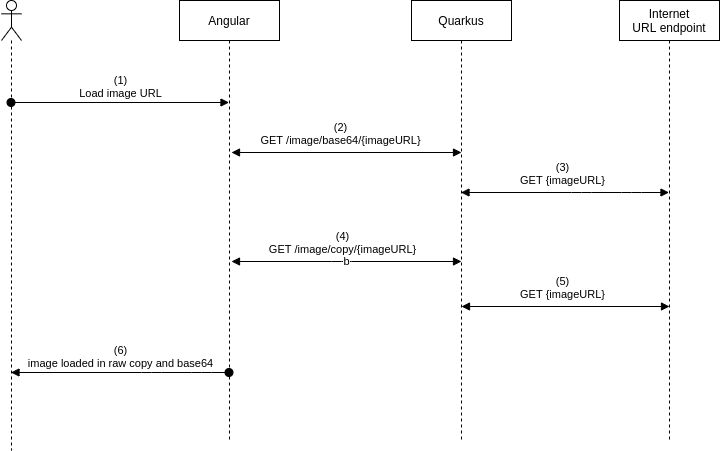
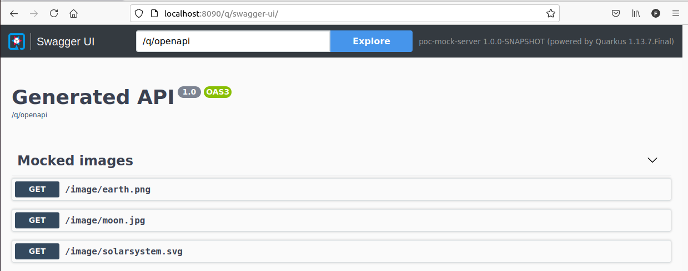
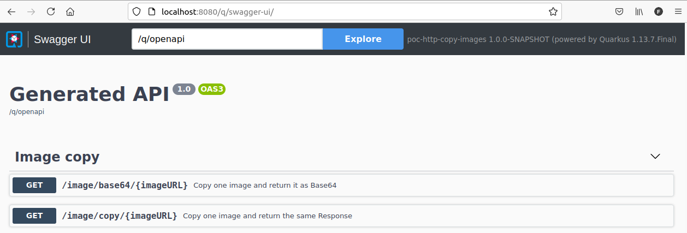
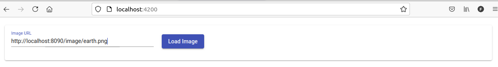
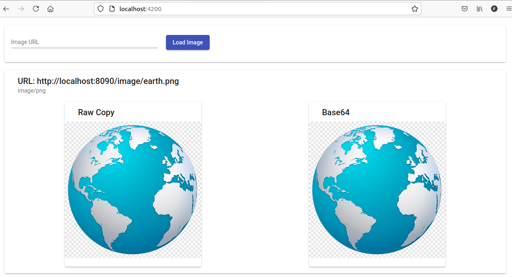
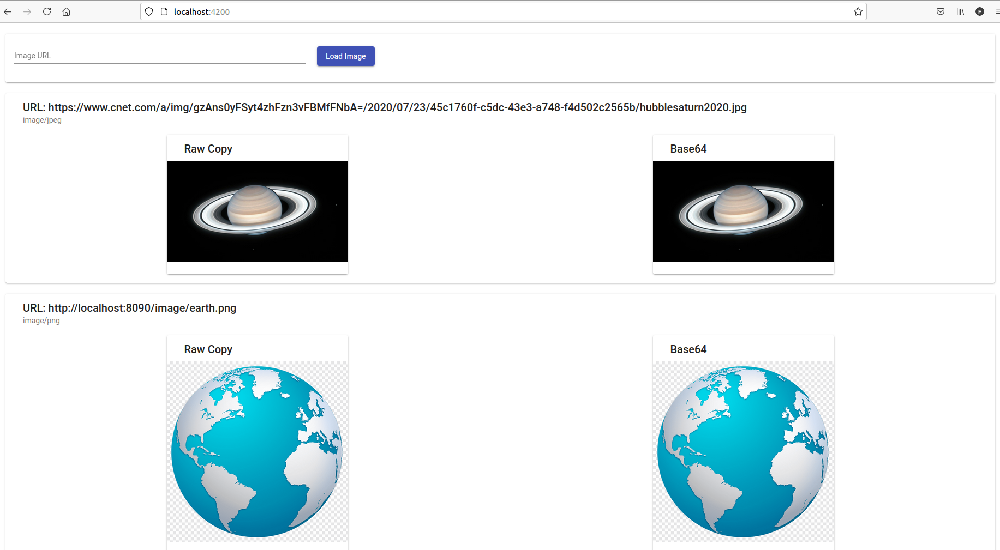

# poc-http-copy-images

A simple POC where Angular sends the URL of an image to the Quarkus back end and then renders the image returned A simple POC where Angular sends the URL of an image to the Quarkus back end and then renders the image returned in the screen. The image is returned by Quarkus in one endpoint as a raw copy and in another endpoint encoded in Base64.in the screen. Quarkus returns the image in two ways: (1) a simple copy from the URL of the image; (2) the image encoded in Base64 with the Media Type.



# Hypothetical problem to solve

Let's imagine a hypothetical situation where only the backend have access to the URL of some images and you want to render these images on the frontend.

In this POC, I propose two ways of solving this problem:
1. The backend access the URL of the image and expose the same Response object;
2. The backend access the URL of the image, encode it into Base64 and expose it into a JSON object with the Media Type.


# Running the POC

## Mock Server

Optionally, you can run a Quarkus mock server which will provide three endpoints with the below images:
- http://localhost:8090/image/earth.png
- http://localhost:8090/image/moon.jpg
- http://localhost:8090/image/solarsystem.svg

*** Optionally, because you can choose any image from the internet to run the test.

Enter inside the mock-server folder and type:
```
$ mvn quarkus:dev -Ddebug=5006
```

The swagger will be available at:
- http://localhost:8090/q/swagger-ui



## Quarkus backend

Enter inside the quarkus folder and type:
```
$ mvn quarkus:dev -Ddebug=5006
```

The swagger will be available at:
- http://localhost:8080/q/swagger-ui



## Angular frontend

Enter inside the angular folder and type:
```
$ npm install
$ ng serve
```

The front end will be available at:

http://localhost:4200/

Ok, in this screen, just put the URL of any image you desire (of the mock or the internet) and click on `Load Image`:



After clicking in the button, the image will be displayed in two columns, the left one is the raw copy from the URL and the right one is the Base64 version:



Any new image searched will be shown and the previous ones will slide down:




